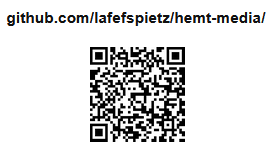
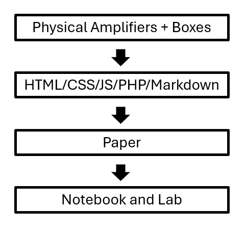
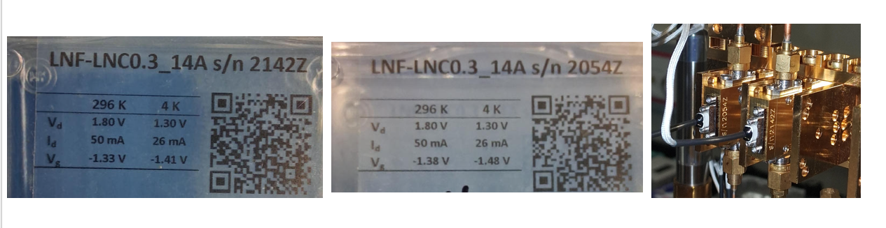
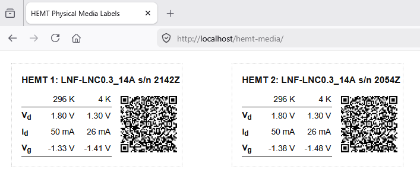
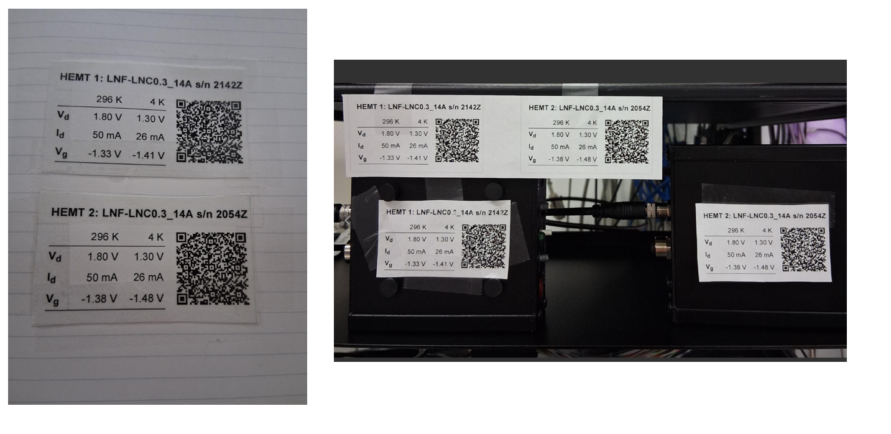

# [hemt-media](https://github.com/lafefspietz/hemt-media)

 - [hemt.html](hemt.html)
 - [hemt.css](hemt.css)
 - [hemt.js](hemt.js)
 - [qrcode.js](https://davidshimjs.github.io/qrcodejs/)
 - [editor.html](editor.html)
 - [readme.html](readme.html)
 - [showdown.js](https://github.com/showdownjs/showdown)
 - [ace.js](https://ace.c9.io/)
 - [README.md](README.md)
 - [load-file.php](load-file.php)
 - [save-file.php](save-file.php)
 - [list-files.php](list-files.php)
 - [local-web-server](https://github.com/lafefspietz/local-web-server)
 - [spime](https://en.wikipedia.org/wiki/Spime)

# &#x1F86B;

# &#x1F86B;

